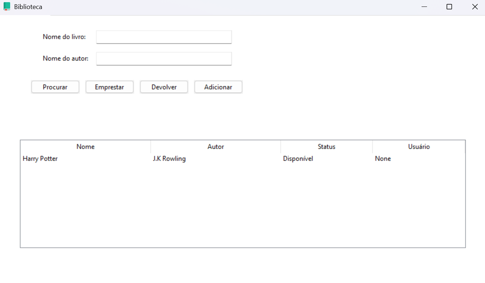
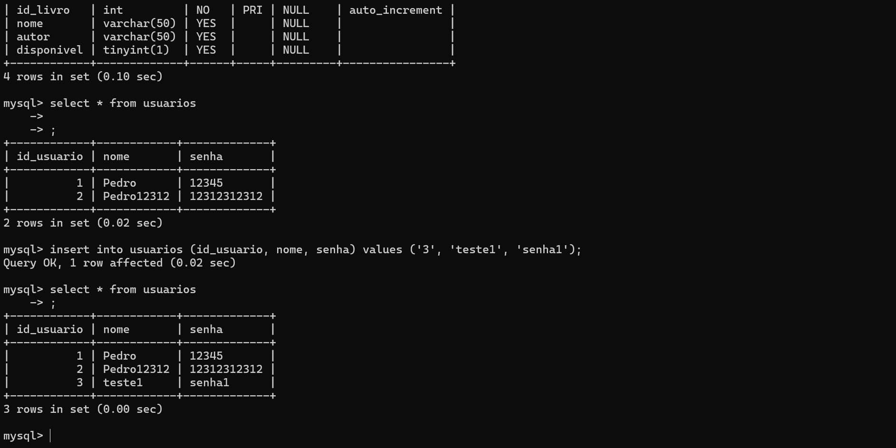

# 📚 Sistema de Gerenciamento de Biblioteca


Sistema de gerenciamento de biblioteca desenvolvido em **Python** com interface gráfica utilizando **Tkinter**.

Criado para praticar desenvolvimento de interfaces, organização de código e manipulação de dados.

---

## 📸 Demonstração

<p align="center">
  
</p>

<p align="center">
  
</p>

---

## ⚙️ Funcionalidades

- Cadastro e login de usuários
- Busca de livros
- Empréstimos e devoluções
- Cadastro de novos livros
- Controle de disponibilidade

---

## 🛠 Tecnologias

- Python 3
- Tkinter
- MySQL
- Bcrypt
- Python-dotenv

---

## 📊 Estatísticas do Projeto


---

## 📂 Estrutura

📁 src

├── main.py → Arquivo principal  
├── login.py → Login e cadastro  
├── interface.py → Interface gráfica  
└── database.py → Sistema do banco de dados com MySQL

---

## ▶️ Executar

Clone o projeto:

```bash
git clone https://github.com/PedrReis-create/library-program
```

Entre na pasta:

```bash
cd library-program
```

Instale as dependências:

```bash
pip install -r requirements.txt
```

Execute o arquivo principal:

```bash
python src/main.py
```

---

## 📚 Aprendizados

- Programação modular
- Interfaces gráficas com Tkinter
- Integração Python + MySQL
- Sistema de autenticação com criptografia de senha
- Organização de dependências do projeto

---

## 🚀 Próximas Melhorias

- Histórico de empréstimos
- Sistema avançado de permissões
- Melhorias na interface gráfica

---

## 👥 Equipe de Desenvolvimento

<table>
<tr>

<td align="center">
<a href="https://github.com/PedrReis-create">
<br>
<b>PedrReis-create</b>
</a>
</td>


<td align="center">
<a href="https://github.com/PedroSilva370">
<br>
<b>PedroSilva370</b>
</a>
</td>

</tr>
</table>

---

⭐ Projeto desenvolvido para evolução e prática em Python.